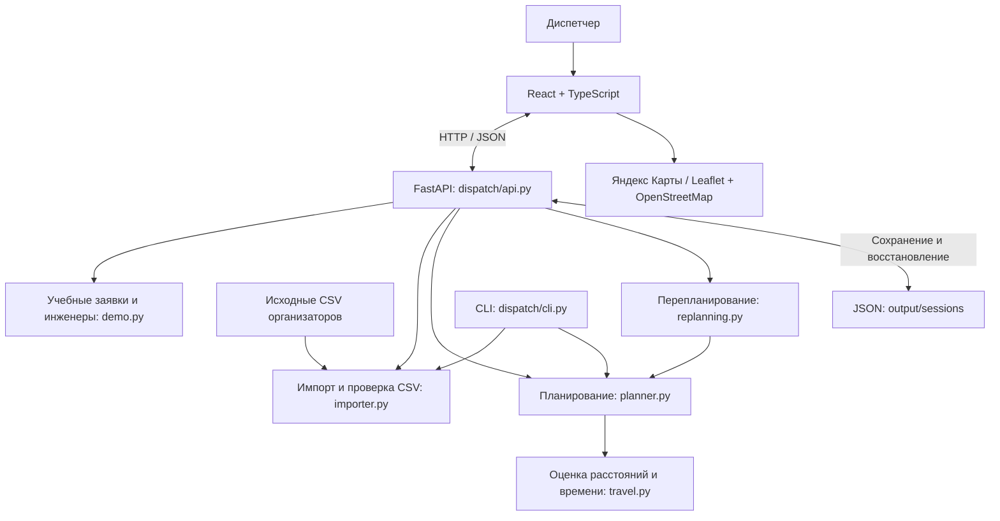

# Архитектура проекта «Уральские самоцветы»

Описание фактической реализации по исходному коду на 20 сентября 2026 года.

## 1. Назначение и архитектурный подход

«Уральские самоцветы» — веб-прототип помощника диспетчера для распределения заявок между выездными инженерами. Он учитывает навыки, транспорт, временные окна клиентов, длительность работ и смены инженеров, сравнивает два алгоритма и пересчитывает будущие выезды при поступлении срочной заявки.

Проект построен как **модульный монолит с клиент-серверным интерфейсом**. Сервер представляет собой одно Python-приложение; расчётная логика разделена на модули и используется как через HTTP API, так и через CLI. Браузер отвечает за отображение и действия диспетчера, сервер — за расчёт и сохранение состояния дня.

Такое устройство подходит для текущего масштаба прототипа: приложение запускается локально одним сервером, а алгоритмы можно проверять отдельно от интерфейса. Разделение логическое: обработчики API, управление сессиями и файловое хранилище пока находятся в одном `dispatch/api.py`, большинство экранов — в одном `frontend/src/main.tsx`.

## 2. Общая схема



Исходные CSV доступны для просмотра и проверки. Они пока не подключены к маршрутизации: адресам не назначены проверенные координаты. Планирование работает на отдельном учебном наборе.

## 3. Технологический стек

| Часть | Реализация | Назначение |
|---|---|---|
| Интерфейс | React 19, TypeScript | Экраны, формы, состояние интерфейса |
| Сборка | Vite 6, pnpm | Локальная разработка и сборка статических файлов |
| Оформление | CSS, Lucide React | Адаптивная раскладка и иконки |
| Основная карта | Яндекс Карты JavaScript API 3.0 | Отображение точек и последовательности визитов |
| Резервная карта | Leaflet 1.9 + OpenStreetMap | Карта при недоступности Яндекса |
| Сервер | Python 3.11+, FastAPI, Uvicorn | HTTP API и раздача собранного интерфейса |
| Проверка запросов | Pydantic | Типы, диапазоны и обязательные поля |
| Расчётное ядро | Стандартная библиотека Python | Планирование без зависимости от веб-фреймворка |
| Хранение | JSON-файлы и кэш в памяти | Сохранение и восстановление учебных дней |
| Проверки | unittest, тесты API, Node.js test runner | Проверка расчётов, сценариев и загрузчика карты |

## 4. Модель предметной области

Основные сущности определены в `dispatch/models.py` через Python dataclasses.

| Сущность | Содержимое |
|---|---|
| `Point` | Широта и долгота с проверкой диапазонов |
| `Job` | ID, адрес, дата, окно начала визита, длительность, навык, координаты, транспортное ограничение, срочность и источник |
| `Engineer` | ID, имя, стартовая точка, смена, набор навыков и транспорт |
| `Stop` | Заявка, время прибытия, начала и окончания, переезд, расстояние и объяснение допустимости назначения |
| `Route` | Инженер и упорядоченный список остановок |
| `Plan` | Алгоритм, маршруты, неназначенные заявки с причинами и допущения расчёта |
| `Scenario` | Заявки, инженеры, оба плана, текущее время, версия, последние изменения и зафиксированные визиты |

`Scenario` находится в `dispatch/api.py`. При выдаче через API к нему добавляются ID сессии и метаданные учебного набора. Метрики плана вычисляются при сериализации: количество назначений, отказов, задействованных инженеров и суммарное расстояние.

Время хранится целыми минутами от начала дня; расстояние — в километрах. План относится к одной дате. TypeScript-типы в `frontend/src/types.ts` описывают соответствующий контракт для интерфейса; они поддерживаются вручную.

## 5. Импорт данных

`dispatch/importer.py` читает CSV с разделителем `;`, поддерживает UTF-8 и Windows-1251, проверяет обязательные столбцы, даты, адреса, типы работ и уникальность ID. Пустые строки пропускаются, адрес офиса выделяется отдельно, ошибки строк возвращаются в отчёте.

Таблица `WORK_RULES` сопоставляет типам работ демонстрационные навыки и длительности. Эти значения являются допущениями прототипа. Импорт не придумывает координаты: у исходных заявок `point = None`.

Предусмотрены два входа: команда CLI `import` для указанного CSV и `GET /api/source/vostok` для конкретного исходного файла проекта. Универсальной загрузки CSV через веб-форму сейчас нет. Контрольное распределение со статусами отклоняется: для него нужна отдельная политика обработки выполненных и отменённых работ.

## 6. Расчёт маршрутов

`dispatch/planner.py` содержит общую функцию `schedule()` и два алгоритма назначения.

### Общие ограничения

Для каждого визита проверяются координаты, требуемый навык и транспорт. Расписание строится последовательно:

```text
прибытие = завершение предыдущей работы + время переезда
начало работы = max(прибытие, начало временного окна)
окончание работы = начало работы + длительность
```

Начало должно попасть в окно клиента, окончание — в смену инженера. Допускается ожидание у клиента. Первый переезд начинается из стартовой точки инженера; обязательного возвращения в неё нет.

### Базовый алгоритм — baseline

Заявки обрабатываются в исходном порядке. Для каждой выбирается первый инженер, которому её можно добавить в конец маршрута без нарушения ограничений. Если такого инженера нет, заявка получает причину неназначения.

### Эвристика вставки — insertion_heuristic

Сначала рассматриваются срочные заявки, затем заявки с ближайшим окончанием окна. Для каждой проверяются все позиции вставки в маршруты инженеров с пересчётом расписания. Допустимые варианты сравниваются последовательно по двум критериям:

1. Предпочтение уже задействованному инженеру.
2. Меньший прирост расстояния.

Это локальная эвристика без гарантии глобального оптимума. Сокращение числа задействованных инженеров может увеличить общий километраж, поэтому интерфейс показывает обе метрики и оба алгоритма.

### Оценка перемещений и проверка результата

`dispatch/travel.py` рассчитывает геодезическое расстояние по координатам и переводит его во время через постоянную скорость выбранного транспорта. Время округляется вверх до минуты. Дорожная сеть, пробки и пересадки не учитываются.

`validate_plan()` отдельно проверяет результат: отсутствие потерянных и повторно назначенных заявок, корректность инженеров, навыков, транспорта, времени и расстояний. Валидатор отделён от построения расписания, но использует ту же модель перемещений.

## 7. Перепланирование при срочной заявке

За пересчёт отвечает `dispatch/replanning.py`. HTTP-обработчик выполняет следующий сценарий:

1. Проверяет поля заявки, версию плана и время события. События не могут идти назад во времени.
2. Добавляет срочную заявку к данным дня.
3. Берёт текущий план эвристики как фактическое состояние дня для обоих сравниваемых алгоритмов.
4. Фиксирует уже выполненные и начатые визиты, а также визиты с уже начатым переездом или ожиданием у клиента.
5. Вычисляет оставшимся доступным инженерам новую стартовую точку и время доступности.
6. Пересчитывает незакреплённые заявки двумя алгоритмами и проверяет результаты.
7. Сравнивает старый и новый план эвристики через `diff_plans()`: исполнитель, позиция в маршруте и время начала.
8. Сохраняет обновлённый сценарий, увеличивает версию и возвращает данные интерфейсу.

Принято правило: если инженер уже выехал к клиенту, он завершает этот визит. Перенаправление в пути не моделируется. Простое переключение просмотра на baseline в интерфейсе не меняет фактический план, используемый при следующем событии.

## 8. API и сохранение состояния

| Метод и путь | Назначение |
|---|---|
| `GET /api/health` | Проверка готовности сервиса |
| `GET /api/maps/config` | Публичный браузерный ключ карты |
| `GET /api/demo/compare` | Независимое сравнение алгоритмов на начальном демо |
| `POST /api/scenarios/demo` | Создание и сохранение нового учебного дня |
| `GET /api/scenarios/{id}` | Получение или восстановление дня |
| `POST /api/scenarios/{id}/urgent` | Добавление срочной заявки и пересчёт |
| `GET /api/source/vostok` | Импорт исходного набора и отчёт о качестве данных |

Текущее состояние хранится в памяти процесса и в `output/sessions/{id}.json`. Запись выполняется через временный файл и атомарную замену `os.replace()`. При отсутствии сессии в памяти сервер читает файл, восстанавливает объекты и проверяет планы. В памяти удерживается до 100 сессий; вытеснение из кэша не удаляет файл.

Для операций с сессиями используется общий `RLock`. Клиент отправляет `version`; несовпадение с текущей версией приводит к HTTP 409. Это защита от изменения устаревшего состояния в рамках однопроцессного запуска. Межпроцессных блокировок и транзакционной БД нет.

ID текущей сессии сохраняется в `sessionStorage` вкладки. После обновления страницы интерфейс запрашивает её у сервера. Кнопка «Новый день» создаёт другую сессию; предыдущая остаётся на диске. Экспорт JSON выполняется в браузере, обратный импорт экспорта не реализован.

## 9. Интерфейс и карта

`frontend/src/main.tsx` содержит приложение и основные компоненты: планирование, реестр заявок, справочник инженеров, сравнение алгоритмов, просмотр исходных данных и форму срочной заявки. Состояние управляется React-хуками; отдельного глобального хранилища нет. Разделы синхронизированы с URL hash и историей браузера.

`frontend/src/types.ts` содержит типы, форматирование времени и расстояний, цвета маршрутов и обёртку `request()` над `fetch` с обработкой ошибок и тайм-аутом 15 секунд. Сервер возвращает весь сценарий; интерфейс выбирает отображаемый план, фильтрует данные и синхронизирует выбранную заявку между картой и расписанием.

`Map.tsx` отвечает за Яндекс Карты, `yandex.ts` — за общую загрузку SDK и обработку её ошибок. При отсутствии ключа, отказе подключения или ожидании более 6 секунд интерфейс переключается на лениво загружаемый `FallbackMap.tsx` с Leaflet и OpenStreetMap.

Карта визуализирует рассчитанные остановки, но не рассчитывает дорожные маршруты. Линии обозначают последовательность визитов. Ключ Яндекса читается сервером из переменной окружения или `.env` и выдаётся отдельным API; в сборку он не зашивается.

Основные стили находятся в `styles.css`, адаптивные правила — в `responsive.css`. Реализованы мобильная навигация, перестройка таблиц, подписи элементов, видимый фокус, управление диалогом с клавиатуры и поддержка уменьшения анимации.

## 10. Структура файлов и запуск

```text
dispatch/
  models.py          Сущности и базовая валидация
  importer.py        Чтение и нормализация исходных CSV
  demo.py            Учебный набор заявок и инженеров
  travel.py          Расстояние и оценка времени переезда
  planner.py         Baseline, эвристика, расписание, валидатор
  replanning.py      Пересчёт будущего и сравнение планов
  api.py             HTTP API, сценарии, хранение, раздача frontend
  map_config.py      Чтение настройки браузерной карты
  cli.py             Импорт и сравнение алгоритмов из терминала
frontend/
  src/main.tsx       Экраны и состояние приложения
  src/types.ts       Контракт API и вспомогательные функции
  src/Map.tsx        Основная карта
  src/yandex.ts      Загрузка SDK Яндекса
  src/FallbackMap.tsx Резервная карта
  src/styles.css     Основное оформление
  src/responsive.css Адаптивное оформление
  tests/             Тесты загрузчика карты
  dist/              Собранный интерфейс
scripts/
  build_frontend.sh  Сборка интерфейса
  serve.py           Запуск, проверка готовности и остановка сервера
tests/               Проверки импорта, алгоритмов, пересчёта и API
output/sessions/     Сохранённые сценарии
start.command        Локальный запуск
stop.command         Локальная остановка
```

В обычном режиме Uvicorn запускает FastAPI на `127.0.0.1:8000`; этот же сервер отдаёт HTML и ресурсы из `frontend/dist`. В режиме разработки Vite обслуживает интерфейс и проксирует `/api` на FastAPI. CLI позволяет запускать импорт и сравнение алгоритмов без веб-сервера и его зависимостей.

## 11. Проверки и границы реализации

Тесты ядра проверяют ограничения расписания, выбор инженера, причины отказов, полноту плана и импорт CSV. Тесты перепланирования проверяют сохранение начатых визитов, ожидание у клиента, повторные события и доступность после окончания смены. Тесты API проверяют валидацию, конфликт версий, изоляцию сессий, восстановление с диска и повреждённые файлы. Тесты загрузчика карты проверяют общий запрос SDK, готовность, повторную загрузку, отказ авторизации и тайм-аут.

Текущая реализация — локальный демонстрационный прототип. В ней нет геокодирования исходных адресов, дорожной матрицы, OR-Tools, авторизации, ролей, полноценной БД, очереди фоновых задач и интеграции с производственной системой заявок. Пересчёт выполняется синхронно в HTTP-запросе; учебный сценарий ограничен 100 заявками. Объяснения назначений формируются по правилам, без нейросетевой модели.

## 12. Возможное развитие

Следующие шаги относятся к будущей архитектуре, а не к уже реализованным возможностям:

1. Проверенное геокодирование исходных CSV и согласованные справочники инженеров, навыков и длительностей.
2. Выделение хранилища сценариев из `api.py` и переход на БД с транзакциями при многопользовательской работе.
3. Общий интерфейс поставщика расстояний и времени для подключения дорожной матрицы вместо текущей оценки.
4. Дополнительный алгоритм на OR-Tools с тем же контрактом плана и независимой проверкой ограничений.
5. Разделение крупных frontend-компонентов на модули по функциям приложения и автоматизация согласования типов API.
6. Авторизация, журнал событий и фоновые расчёты при переходе к рабочей эксплуатации.

Ключевой принцип развития — сохранять единые сущности и проверяемые ограничения, заменяя источник данных, алгоритм расчёта или хранилище по мере появления реальных требований.
